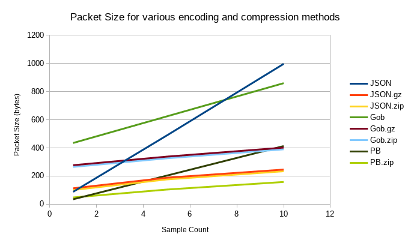

# Packet Encoding and Compression tests

This exercise tries to determine the best packet encoding and compression format for
small packets (say a data structure with 4 fields), and support multiple data types
in the same datastream. JSON is most often used, but has several drawbacks:

1. it is not space efficient with repeated text fields
1. you cannot concat values to a stream as the entire thing needs to be enclosed in `{}`
   or `[]`
1. type must be inferred by fields present, or specified using a dedicated `type` field

3 different encoding methods will be tested including:

1. [JSON](https://json.org/)
1. [Go Gob](https://golang.org/pkg/encoding/gob/)
1. [Protobuf](https://developers.google.com/protocol-buffers/)

Effect of compressing packets will also be examined.

## Running test programs

To run these tests:

- `go get -u github.com/golang/protobuf/protoc-gen-go`
- `protoc --go_out=. *.proto`
- `go run cmd/packet-encoding-compression-tests/main.go > encoding-compression.csv`
- `go run cmd/protobuf-oneof/main.go`
- `go run cmd/empty-field-cost/main.go`

## Encoding/Compression results

The chart below shows the results:

From this, we can draw the following conclusions:

- While the self-describing aspect of Gob serialization is very handy when writing Go
  programs, it is not very efficient, especially with small packets. Apparently including
  the type specification takes a lot of space. For long packets or files, this becomes
  minimimal as the type only needs to be specified once, but for this problem, JSON and
  Protobuf are more efficient.
- Protobuf is very efficient for small packets (less than 1/2 the size of JSON).
- zlib (zip) compression is more efficient than gzip (gz) for small data sizes.
- with JSON or Protobuf, compressing one packet adds more overhead than it saves.
  At 2 packets, the compressed result is smaller.

## Enocding type information

We would like to be send different types of packets in the same data stream. Gob is the
most convenient in this regard as it serializes the type information directly in the stream,
but there is quite a bit of overhead in doing this. Protobuf type information is stored
in the enoder/decoder, which must match. One way to encode type in Protobuf is to wrap each
packet element with a
[oneof](https://developers.google.com/protocol-buffers/docs/proto3#oneof)
field. From the protobuf-oneof test, this adds 2 bytes per packet, which seems fairly
efficient. Adding another field would likely take at least this much space.

## Unused fields

The empty-field-cost test program illustrates that adding a field to a protobuf message
has no cost unless you actually fill it with something.

`Sample len: 28, SampleDuration with zero dur: 28, SampleDuration: 33`

In the above test, adding a floating point field adds 5 bytes to the message, only if it
is set to something other than zero. This is very handy as it allows messages to be very
flexible and the unused fields simply take no space.
